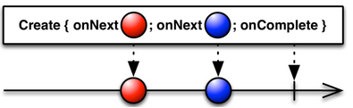

- 使用`Create`操作符从头开始创建一个Observable，我们可以自定义发射数据的逻辑，注意，在结束时都应该调用`onCompleted`一次，无论是否发生错误，且此后不应该再调用其他方法；

- 建议你在传递给create方法的函数中检查观察者的 `isUnsubscribed` 状态，以便在没有观察者的时候，让你的Observable停止发射数据或者做昂贵的运算；

- create方法默认不在任何特定的调度器上执行。



代码示例：

```
//订阅者
Subscriber subscriber= new Subscriber<Integer>() {
    @Override
    public void onNext(Integer item) {
        Log.d(TAG, "Next: " + item);
    }
    @Override
    public void onError(Throwable error) {
        Log.d(TAG, "Error: " + error.getMessage());
    }
    @Override
    public void onCompleted() {
        Log.d(TAG, "Sequence complete.");
    }
};
// create方法默认不在任何特定的调度器上执行。
Observable observable = Observable.create(new Observable.OnSubscribe<Integer>() {
    // 当Observable.subscribe被调用时（有订阅者时）执行call方法
    @Override
    public void call(Subscriber<? super Integer> observer) {
        try {
            // 检查观察者的isUnsubscribed状态，以便在没有观察者的时候，让Observable停止发射数据或者做昂贵的运算
            for (int i = 1; i < 5; i++) {
                if(i == 4){
                    // 取消订阅 (Unsubscribing),调用这个方法表示你不关心当前订阅的Observable了，
                    // 因此Observable可以选择停止发射新的数据项（如果没有其它观察者订阅）。
                    subscriber.unsubscribe();
                }
                if (!observer.isUnsubscribed()) {
                    observer.onNext(i);
                }
            }
            if (!observer.isUnsubscribed()) {
                observer.onCompleted();
            }
        } catch (Exception e) {
            observer.onError(e);
        }
    }
} );
//订阅
observable.subscribe(subscriber);
```

输出:

```
Next: 1
Next: 2
Next: 3
```